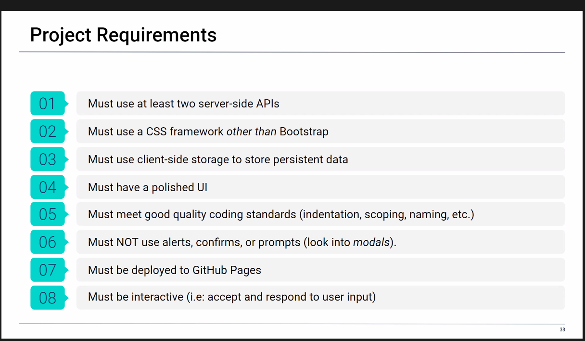
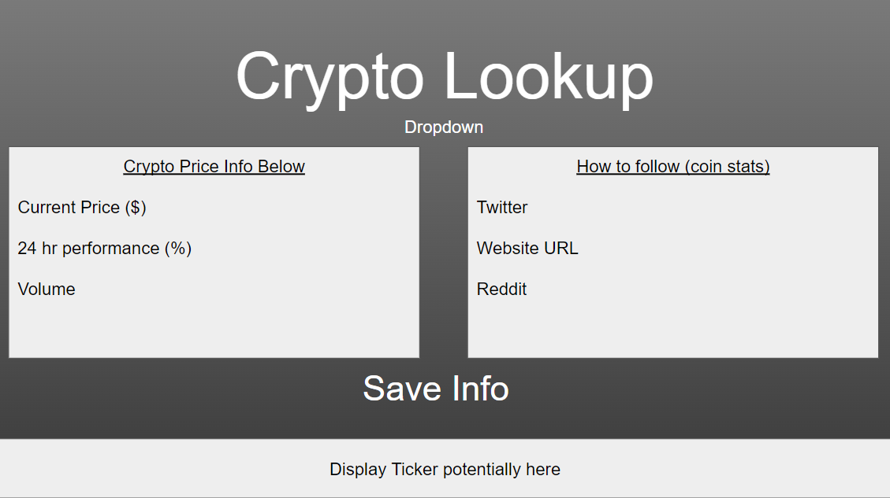
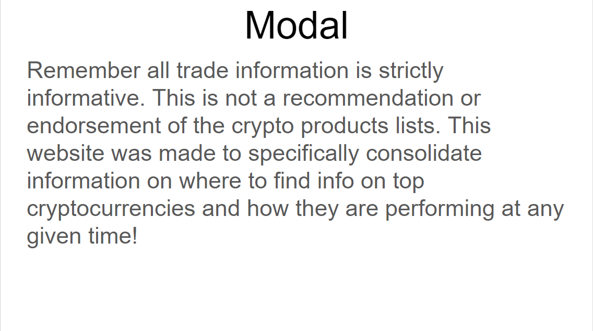
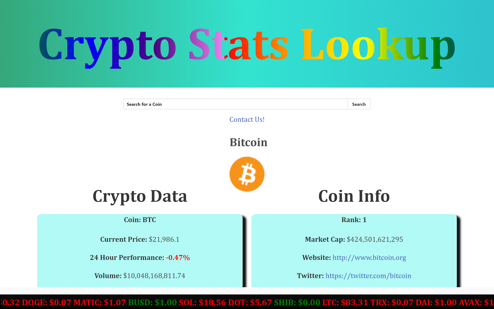
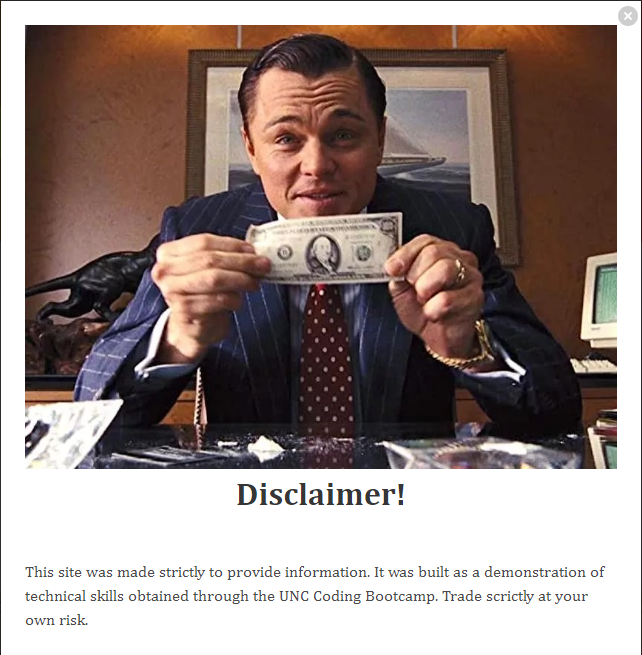

# Group-3-Cryto-Price-Project-1

## User Story

Cyrto Lookup was built as a colaboration project by students in the 24 week UNC Software Engineering Bootcamp. As students we were given specific project requirements listed below in the Acceptance Criteria. With those requirments in mind, we began brain storming ideas, specifically ones where we could find public APIs to get access to the information we might need. One idea suggested was of a page that would return stock info after the user input a specific stock ticker. From this we encountered some difficulties in locating APIs that did not require keys, while this was not a complete roadblock, we felt it best to pivot to try to simplify the task at hand. From this, emerged the idea of trying Cyrto Currencies instead. While building our wire frame (images included below) we discussed with our TAs the plan for the layout. After discussing the possible roadblocks in building a search bar that could allow potentially infinite user inputs and how we would try to scope parameters around those searches we again pivoted. This time we decided a drop down menu where the user  selects from five pre-selected cryto coins would again make design easier. Once we had what we felt was a solid wire frame and concept we began to break the project down in Github Projects. We tried to identify all tasks in their smallest forms and created issues for it. Once completed We discussed and assigned people to each task. Finally we built a skeleton template for everyone to work off. The Site presented below in the images and deployment section is our Version 1.0. 

 

As someone interested in Crypto Currencies

I wanted to be able to look up specific coins and see how they are performing. 

I also want to be able to see where I can find more information on these coins, such as Twitter, the coin website, and (...)

When I search for a coin

Then I am met with infomation that pertains to just that coin

When I leave the page 

Then the page will retain my past searches and field my last search upon reloading the page.

---
## Acceptance Criteria

<strong>

Project Requirements

</strong>

    

---
## Wire-Frame

<strong>

WireFrame - Page 1

</strong>

    

<strong>

WireFrame - Modal

</strong>

    

---
## Mock-Up

<strong>

Mockup-Mobile

</strong>

<strong>

Mockup-Web

</strong>

    

<strong>

Mockup-Modal

</strong>

    

---

## Deployment 

[Crypto Lookup](https://a-witthohn.github.io/Group-3-Crypto-Price-Project-1)

[Git Hub Repository](https://github.com/A-Witthohn/Group-3-Crypto-Price-Project-1)

---
## APIs Used

Cyrto Lookup utilizes two APIs specifically and those APIs are linked below.

The first API is Public API, This API info is displayed in the left box on the webpage and is the top box seen when scrolling on mobile.

[Public API](https://documenter.getpostman.com/view/5734027/RzZ6Hzr3?version=latest)

The second API is CoinCap API 2.0, this info is displayed in the right box on the webpage or the bottom box seen when scrolling on the mobile.

[CoinCap API 2.0](https://docs.coincap.io/#ee0c0be6-513f-4466-bbb0-2016add462e9)

---
## Future Development Ideas 💡

    1. Search Bar Functionality ✅

    2. Create a save info button which then logs information on a seperate html page. This page can be curated by the user to build a collection of only coins that are of interest to them. 

    3. Include a link where users can reach out to the Devs. to suggest how to further improve the site. ✅

    3b. This could be displayed in one of two ways a link that directs the user straight to an email or by a form that the user can also preselect a subject for that email (ex - Subject - New Coin Added , Subject - New Feature Idea) ✅

    4. Build a function in JS using Jquery to set the title and background of the content boxes to sample the colors of the coin searched for a uniform style that changes with each input. 

    5. Find an API that can pull analysis on the coin searched. 

---
## Disclaimer

Cryto Lookup was created strictly as an educational tool. It is not an endorsement of any specific Cryto currencies. The infomation provided is to demostrate the understanding and potential implementations of concepts in software engineering. Trade at your own risk!

## License

© 2023 edX Boot Camps LLC. Confidential and Proprietary. All Rights Reserved.
